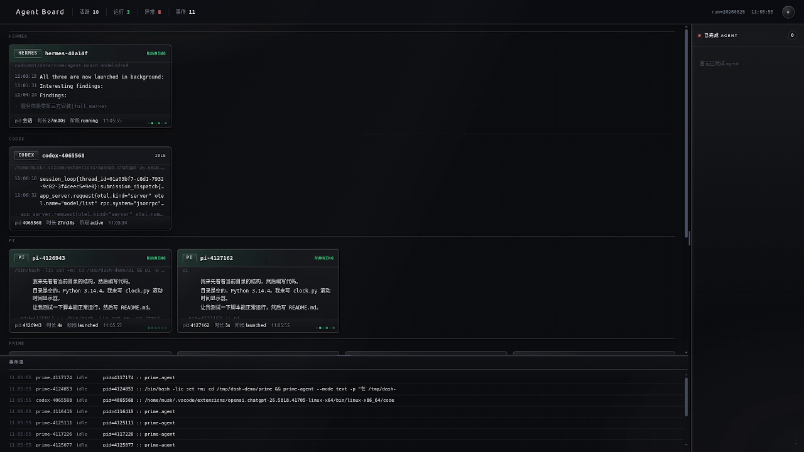
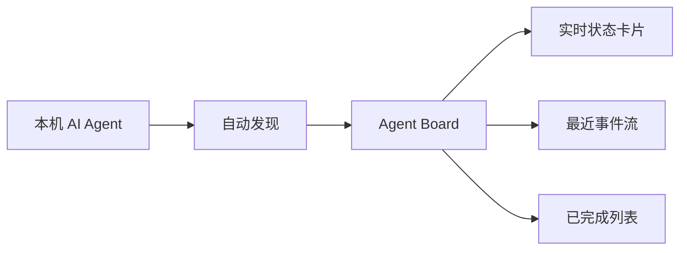

# Agent Board

一个轻量、零第三方 Python 依赖的本地 AI Agent 实时看板。

它会自动发现本机正在运行的 Codex、Prime、Pi、OpenCode、Hermes 等 Agent，集中展示运行状态、最近活动、事件流和已完成任务。打开浏览器，就能知道“现在有哪些 Agent 在工作、卡在哪里、刚刚做了什么”。

看板支持深色/浅色主题、实时刷新、状态排序和可调节布局。

## 演示



## 为什么使用它？

- 一眼查看多个 AI Agent，不必反复切换终端窗口
- 自动发现本机 Agent，无需手动登记
- 实时显示运行、思考、等待、异常和完成状态
- 事件流记录最近发生的任务活动
- 数据只在本机处理，服务默认只监听 `127.0.0.1`
- Python 标准库实现，无 npm、无构建步骤、无第三方运行时依赖

## 快速开始

需要：Python 3.8+ 和 `curl`。

> 当前完整功能优先支持 Linux；macOS 已支持进程级自动发现，Windows 仍主要支持手动启动看板服务。详见下方的[平台支持](#平台支持)。

```bash
git clone https://github.com/harrymiya/agent-board.git
cd agent-board
./board.sh
```

启动后访问：<http://127.0.0.1:8710>

如果没有自动打开浏览器，手动访问上面的地址即可。

### 常用命令

| 命令 | 作用 |
| --- | --- |
| `./board.sh` | 启动服务并打开看板 |
| `./board.sh start` | 仅启动服务 |
| `./board.sh stop` | 停止服务 |
| `./board.sh restart` | 重启服务 |
| `./board.sh status` | 查看运行状态 |
| `./board.sh log` | 查看最近日志 |

也可以直接启动服务：

```bash
python3 server/agentboard_server.py
```

## 平台支持

| 平台 | 看板服务 | Agent 自动发现 | 推荐启动方式 |
| --- | --- | --- | --- |
| Linux | ✅ 完整支持 | ✅ `/proc` 进程扫描 | `./board.sh` |
| macOS | ✅ 可运行 | ✅ 进程发现已支持（没测试...） | `python3 server/agentboard_server.py` |
| Windows | ✅ 可运行 | ⚠️ 暂不支持 | `py server\\agentboard_server.py` |

说明：

- macOS 使用系统 `ps` 获取进程信息，使用 `lsof` 匹配 Agent 的项目目录；部分 Agent 的专属会话数据仍取决于其 macOS 本地存储位置。
- Windows 当前没有原生 `/proc`，`board.sh` 也不是 Windows 原生脚本；Git Bash/WSL 只能提供有限兼容。
- 在 macOS 上如果某个 Agent 没有显示，请确认 `ps`、`lsof` 可用，并检查该 Agent 是否把会话数据写入了看板适配器支持的位置。
- 跨平台适配计划是继续补充 Windows 进程提供器：Linux 使用 `/proc`，macOS 使用 `ps`，Windows 使用 PowerShell/WMI。

## 看板里有什么？



### 状态说明

| 状态 | 含义 |
| --- | --- |
| 🟢 `RUNNING` | 正在执行任务 |
| 🟣 `THINKING` | 正在思考或生成内容 |
| 🟡 `WAITING` | 等待输入、队列或外部条件 |
| 🔴 `ERROR` | 执行失败或进程异常退出 |
| ⚪ `IDLE` | 进程还在，但暂时没有活动 |
| ✅ `DONE` | 任务已经完成 |

## 配置

常用参数：

```bash
python3 server/agentboard_server.py \
  --port 8710 \
  --root ~/.hermes/agent-board \
  --interval 0.5
```

| 参数 / 环境变量 | 说明 | 默认值 |
| --- | --- | --- |
| `--port` / `AGENTBOARD_PORT` | 服务端口 | `8710` |
| `--root` / `AGENTBOARD_ROOT` | 看板数据目录 | `~/.hermes/agent-board` |
| `--run` / `AGENTBOARD_RUN` | 固定查看某个日期目录 | 最近日期 |
| `--interval` / `AGENTBOARD_INTERVAL` | 刷新间隔，单位秒 | `0.2` |
| `AGENTBOARD_AUTO_INSTALL=1` | 允许启动脚本自动安装缺失依赖 | 默认关闭 |
| `AGENTBOARD_ADAPTERS` | 加载额外 Agent 适配器，逗号分隔的 Python 模块名 | 未设置 |

例如：

```bash
AGENTBOARD_PORT=9000 ./board.sh start
```

## 数据与隐私

- 看板默认只绑定 `127.0.0.1`，不会主动暴露到局域网
- Agent 状态来自本机进程、会话文件和本地数据库
- 数据默认写入 `~/.hermes/agent-board`
- 如果要让其他设备访问，建议放在带认证的反向代理后面
- 看板可能显示 Agent 的最近活动或思考摘要，请根据自己的数据安全要求使用

## 常见问题

### 页面打不开

检查服务状态和日志：

```bash
./board.sh status
./board.sh log
```

### 端口被占用

换一个端口：

```bash
AGENTBOARD_PORT=9000 ./board.sh
```

### 看不到某个 Agent

确认该 Agent 正在运行，并检查它的进程命令行是否能被自动发现。也可以先单独执行发现：

```bash
AGENTBOARD_ROOT=~/.hermes/agent-board \
python3 discover/hermes_board_discover.py
```

## 开发者信息

项目运行时只使用 Python 标准库。运行测试：

```bash
python3 -m unittest discover -s tests -p 'test_*.py'
```

Agent 适配器位于 `discover/adapters/`，每种 Agent 独立维护。第三方适配器只需暴露 `adapter` 或 `get_adapter()`，然后通过 `AGENTBOARD_ADAPTERS=your_package.adapter` 加载，无需修改核心发现流程。

主要目录：

```text
server/    HTTP/WebSocket 服务
discover/  Agent 自动发现
  adapters/ 各类 Agent 独立适配器
web/       单页看板界面
tests/     自动化测试
```

欢迎提交 Issue 和 Pull Request。

## License

[MIT](LICENSE)
